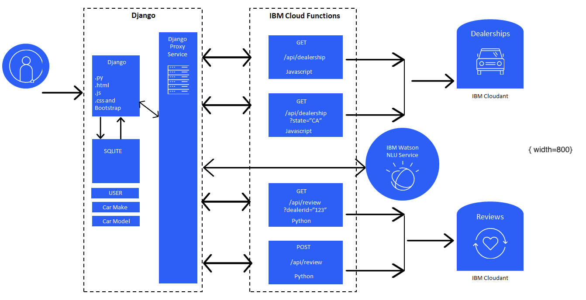

# Project Breakdown

* Prework: Sign up for IBM Cloud Lite account and create a Watson Natural Language Understanding service.
:<74c6fca23395b336db497076206c8d86>
* Create an IBM Cloud Lite account, if you don’t have one already.
* Create an instance of the Natural Language Understanding (NLU) service.
* Fork the GitHub repo containing the project template. The main web application is a predefined Django application,
you will need to add some new features then build and run your project implementation.

* Fork the repository in your account.
* Clone the repository in the IBM Skills Network Cloud IDE environment.
* Create static pages to finish the user stories.
* Run the application locally.
* Add user management to the Django application.

* Implement user management using the Django user authentication system.
* Set up continuous integration and delivery.
* Implement backend services.

* Create cloud functions to manage dealers and reviews.
* Create Django models and views to manage car model and car make.
* Create Django proxy services and views to integrate dealers, reviews, and cars together.
* Add dynamic pages with Django templates.

* Create a page that displays all the dealers.
* Create a page that displays reviews for a selected dealer.
* Create a page that lets the end user add a review for a selected dealer.
* Run and test your application

* Run your application on Cloud IDE
* Test the updated application locally

### Solution architecture

* The solution will consist of multiple technologies

* The user interacts with the Django application through a web browser.
* The Django application handles the user authentication using the SQLite database as the persistance layer.
* The SQLite database also stores the Car Make and the Car Model data.
* The dealerships and the reviews are stored in Cloudant, a NoSQL document based database.
* IBM Cloud functions are used to interface with the Cloudant database to get dealerships, get reviews and post reviews.
* The Django application talks to the IBM Cloud Functions via a set or proxy services.

